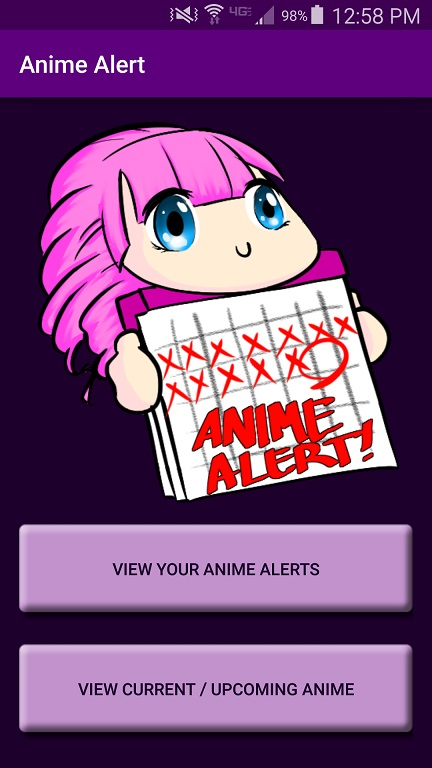
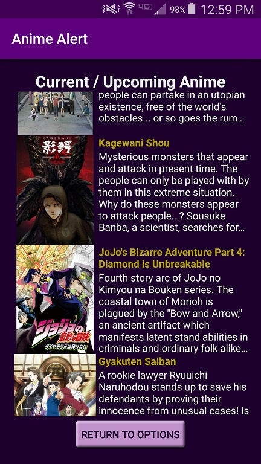

# AnimeAlert
###Authors: Henry Pan, Huishi (Leslie) Li, Sarah Borland

**Permission Requirement: Location, Read / Write Calendar, Internet**

AnimeAlert is an Android application that notifies you when an airing anime is being simulcasted.

Browse a chart of current and upcoming anime and add them to your Anime Alert list!

This will add the anime to your Android calendar, notifying you when that anime airs in Japan!

If you wish to stop receiving notifications about a certain anime, you can remove the entry from your Anime Alert list and it will automatically remove it from your calendar.

### Images 

For more screenshots, check the screenshots folder.
